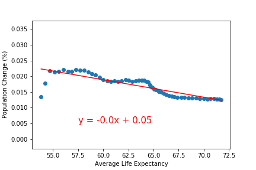

<!DOCTYPE html>
<html lang="en">

<head>
    <meta charset="UTF-8">
    <meta name="viewport" content="width=device-width, initial-scale=1.0">
    <meta http-equiv="X-UA-Compatible" content="ie=edge">
    <title>ETL PROJECT</title>
    <!-- Bring in our bootstrap stylesheet -->

    <link rel="stylesheet" href="https://stackpath.bootstrapcdn.com/bootstrap/4.3.1/css/bootstrap.min.css" integrity="sha384-ggOyR0iXCbMQv3Xipma34MD+dH/1fQ784/j6cY/iJTQUOhcWr7x9JvoRxT2MZw1T" crossorigin="anonymous">

    
     
    

    <link rel="stylesheet" href="style.css">

</head>

<body>
    <!-- <nav class="navbar navbar-expand-lg navbar-light bg-light">
        <a class="navbar-brand" href="#">World Population 1960-2016</a>
        <button class="navbar-toggler" type="button" data-toggle="collapse" data-target="#navbarSupportedContent"
            aria-controls="navbarSupportedContent" aria-expanded="false" aria-label="Toggle navigation">
            
        </button>
        

            <ul class="navbar-nav mr-auto">   
        
            <li class="nav-item dropdown">
                <a class="nav-link dropdown-toggle" href="#" id="navbarDropdown" role="button" data-toggle="dropdown"
                    aria-haspopup="true" aria-expanded="false">
                    ETL
                </a>
                

                    <a class="dropdown-item" href="Extract.html">Extract</a>
                    <a class="dropdown-item" href="Transform.html">Transform</a>
                    <a class="dropdown-item" href="Load.html">Load</a>
                    

                

            </li>
            
            <ul class="navbar-nav mr-auto">
            </li>
            <li class="nav-item">
                <a class="nav-link" href="visualizations.html">Visualizations</a>
            </li>
            <li class="nav-item">
                <a class="nav-link" href="Data.html">Data</a>
            </li>
            </ul>
        

    </nav> -->

    <!-- Start nav -->
<nav class="navbar navbar-expand-lg navbar-light">
    <a class="navbar-brand" id="lat-text" href="index.html">World Population 1960-2016</a>
    <button class="navbar-toggler" type="button" data-toggle="collapse" data-target="#navbarSupportedContent"
        aria-controls="navbarSupportedContent" aria-expanded="false" aria-label="Toggle navigation">
        
    </button>
    

        <ul class="navbar-nav ml-auto">
            <li class="nav-item dropdown">
                <a class="nav-item nav-link dropdown-toggle" href="#" id="navbarDropdown" role="button"
                    data-toggle="dropdown" aria-haspopup="true" aria-expanded="false">
                    ETL
                </a>
                

                    <a class="dropdown-item" href="Extract.html">Extract</a>
                    <a class="dropdown-item" href="Transform.html">Transform</a>
                    <a class="dropdown-item" href="Load.html">Load</a>
                

            </li>
            <li class="nav-item">
                <a class="nav-link" href="Visualizations.html">Visualizations</a>
            </li>
            <li class="nav-item">
                <a class="nav-link" href="Data.html">Data</a>
            </li>
        </ul>
    

</nav>
<!-- End nav -->

    

        

            

                

                    

                        <h2>
 ETL PROJECT REPORT
</h2>
                        

                                
 The purpose of this project is to go over the ETL process to analyze the World Population Data from 1960 to 2016.
                                    We are looking for a big picture of the world by analyzing the factors of Fertility Rates vs Life Expectancy.
                                
 First we obtained the data from Kaggle. We chose three data sets in csv format representing:
                                                                                                          
                                    <ul>                                        
                                        <li><a href="https://www.kaggle.com/gemartin/world-bank-data-1960-to-2016?select=country_population.csv">World Population</a></li>
                                        <li><a href="https://www.kaggle.com/gemartin/world-bank-data-1960-to-2016?select=fertility_rate.csv">Fertility Rates</a></li>
                                        <li><a href="https://www.kaggle.com/gemartin/world-bank-data-1960-to-2016?select=life_expectancy.csv">Life Expectancy</a></li>
                                    </ul>
                                
In our correlation analyses, both fertility rates and life expectancy appeared to have a strong correlation with population growth.

                                    
                                

                                    <h5 class = "text-left">Average Fertility Rate</h5>
                                    <figure>
                                    
                                                                         
                                    

                                    </figure>                
                                
                   
                                
                                
To analyze the correlation between the population change and the average fertility rate we used a linear regression analysis. As a result, the scatterplot shows a strong positive linear relationship between Average Fertility Rates and World Population Change.

                                
With a Correlation Coefficient of 0.90 we can conclude there is a large positive linear relationship between Average Fertility Rates and Population Change.

                                
With a r-square of 0.8133 we can account 81.33% of the Population change variability to Average Fertility.

                               
                                

                                    <h5 class = "text-left">Average Life Expectancy</h5>
                                    <figure>
                                    
                                     
                                    
                                    

                                    </figure>                
                                
 
                                
To analyze the correlation between the population change and the Average Life Expectancy rate we used a linear regression analysis. As a result, the scatterplot shows a strong negative linear relationship between Average Life Expectancy and World Population Change.

                                
With a Correlation Coefficient of -0.854 we can conclude there is a large negative linear relationship between Average Life Expectancy and Population Change.

                                
With a r-square of 0.7299 we can account 72.99% of the Population change variability to Average Life Expectancy

                                

                                

                                

                        

                    

                

            

        
    
        
    

</body>

</html>
